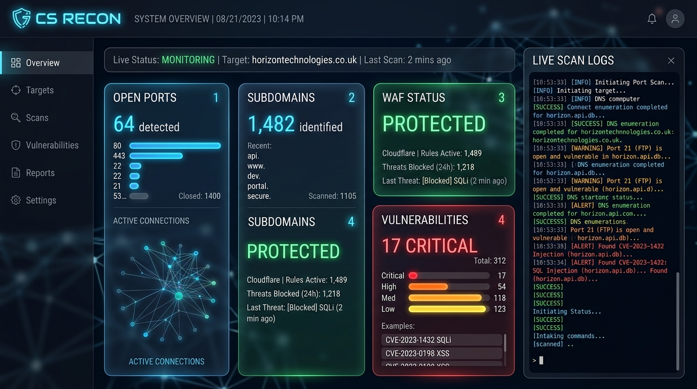

# ⚡ CS RECON — Enterprise Automated Reconnaissance & OSINT Framework

[](https://www.python.org/)
[](LICENSE)
[]()

**CS RECON** is a high-speed, modular, multi-threaded automated reconnaissance & OSINT framework designed for red teamers, penetration testers, and bug bounty hunters. It features zero-dependency native Python fallbacks, WAF detection, subdomain enumeration, port scanning, secret scanning, and interactive glassmorphic HTML reports.



---

## 📥 Step-by-Step Installation & Usage Guide (By Operating System)

> ⚠️ **Important**: Do not copy and paste individual source files. Always clone the repository using `git clone` to ensure all script assets, styles, and dependencies are included.

---

### 🐧 1. Linux (Kali Linux, Ubuntu, Debian, Arch Linux)

#### Step 1: Clone the Repository
Open your terminal and run:
```bash
git clone https://github.com/jahan-sarwar/CS-Recon.git
cd CS-Recon
```

#### Step 2: Automated Dependencies Setup
Run the included setup script to automatically install core security tools (`nmap`, `whois`, `dnsutils`, `subfinder`, `whatweb`, `nikto`, `gobuster`, etc.):
```bash
chmod +x setup.sh
sudo ./setup.sh
```

#### Step 3: Install Python Dependencies
```bash
pip3 install -r requirements.txt
```

#### Step 4: Run CS RECON
```bash
python3 cs_recon.py -t example.com --full
```

---

### 🍎 2. macOS

#### Step 1: Clone the Repository
Open Terminal (`Cmd + Space` -> `Terminal`) and clone the project:
```bash
git clone https://github.com/jahan-sarwar/CS-Recon.git
cd CS-Recon
```

#### Step 2: Install Core Security Binaries via Homebrew
If Homebrew is not installed, install it from [brew.sh](https://brew.sh/). Then install required security tools:
```bash
brew install python3 nmap whois bind subfinder gobuster ffuf whatweb
```

#### Step 3: Install Python Dependencies
```bash
pip3 install -r requirements.txt
```

#### Step 4: Run CS RECON
```bash
python3 cs_recon.py -t example.com
```

---

### 🪟 3. Windows (PowerShell / Command Prompt / WSL)

#### Option A: Native Windows (PowerShell / Command Prompt)

##### Step 1: Clone the Repository
Open PowerShell or CMD:
```powershell
git clone https://github.com/jahan-sarwar/CS-Recon.git
cd CS-Recon
```

##### Step 2: Install Python Packages
Make sure Python 3.8+ is installed from [python.org](https://www.python.org/). Then run:
```powershell
pip install -r requirements.txt
```

##### Step 3: Run CS RECON
```powershell
python cs_recon.py -t example.com
```

> 💡 *Note: On native Windows, CS RECON automatically uses built-in Python socket & HTTP engines for zero-dependency scanning.*

#### Option B: Windows Subsystem for Linux (WSL) — Recommended for Windows
If you have WSL (Ubuntu on Windows) installed:
```bash
git clone https://github.com/jahan-sarwar/CS-Recon.git
cd CS-Recon
chmod +x setup.sh
sudo ./setup.sh
python3 cs_recon.py -t example.com --full
```

---

## 💻 Detailed Scan Command Examples

### 1. Basic Recon Scan
Probes domain WHOIS, DNS records, SSL certificates, security headers, and subdomains:
```bash
python3 cs_recon.py -t example.com
```

### 2. Full Multi-Threaded Recon Scan
Performs deep port probing, WAF detection, subdomain enumeration, secret scanning, and remediation analysis:
```bash
python3 cs_recon.py -t example.com -o my_report --threads 20 --full
```

### 3. Check Available System Tools & Dependencies
Verifies installed security tools on your machine:
```bash
python3 cs_recon.py --check-deps
```

### 4. Help & Command Reference
```bash
python3 cs_recon.py --help
```

---

## 📊 Glassmorphic HTML Dashboard & Reports

CS RECON generates interactive HTML dashboards with real-time risk charts, filterable tables, and CSV export options:

- `cs_recon_report.html` — Interactive visual HTML dashboard
- `cs_recon_report.json` — Machine-readable telemetry report

---

## 📁 Project Structure

```
CS-Recon/
├── cs_recon.py                   # Main Framework CLI & Recon Engine
├── cs_recon_dashboard_preview.jpg # Dashboard Preview Image
├── setup.sh                      # Automated Dependencies Installer for Linux/WSL
├── requirements.txt              # Optional Python Dependencies
├── README.md                     # OS-Specific Installation & Usage Documentation
├── .gitignore                    # Git Ignore Configuration
└── LICENSE                       # MIT License
```

---

## 📄 License

This project is licensed under the [MIT License](LICENSE).
